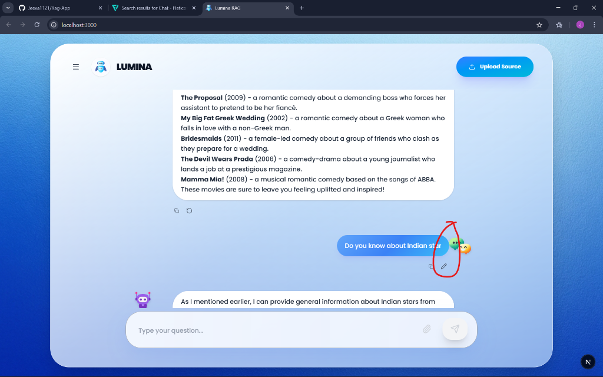

# Lumina RAG-App 🤖✨

Lumina is a professional RAG (Retrieval-Augmented Generation) application built for intelligent document analysis and high-performance chatting.



## 🚀 Quick Start

### 1. Backend Setup (Python)
Navigate to the `backend` folder and install dependencies:
```bash
cd backend
pip install fastapi uvicorn python-multipart langchain langchain-community langchain-google-genai langchain-text-splitters pymupdf faiss-cpu python-dotenv
```

**Required Packages Detail:**
- `fastapi`: High-performance web framework.
- `uvicorn`: ASGI server for running FastAPI.
- `langchain`: AI orchestration framework.
- `langchain-google-genai`: Integration for Gemini models.
- `faiss-cpu`: Efficient similarity search for vector embeddings.
- `pymupdf`: Optimized engine for reading and parsing PDFs.
- `python-dotenv`: Environment configuration.

Run the backend:
```bash
python main.py
```

### 2. Frontend Setup (Next.js)
Navigate to the `frontend` folder and install dependencies:
```bash
cd frontend
npm install next react react-dom framer-motion lucide-react sonner tailwind-merge clsx react-markdown three @react-three/fiber @react-three/drei
```

**Required Packages Detail:**
- `next`: React framework for production.
- `framer-motion`: For premium, fluid animations.
- `react-markdown`: Renders AI responses with proper formatting.
- `three`, `@react-three/fiber`: For the 3D mascot visualization.
- `sonner`: Sleek toast notifications.
- `lucide-react`: Modern icon set.

Run the frontend:
```bash
npm run dev
```

## ✨ Features
- **Intelligent RAG**: Upload PDFs and ask complex questions based on the content.
- **ChatGPT-Style Actions**: Real-time inline editing and regeneration in the thread.
- **Session History**: Clear management with one-click deletion and session persistence.
- **Premium UI**: Ultra-responsive design with glassmorphism, 3D mascots, and custom avatars.

## 🔑 Environment Variables
Create a `.env` in `backend` and `.env.local` in `frontend`:
- `GOOGLE_API_KEY`: Required for document analysis and Gemini logic.
- `GROQ_API_KEY`: For ultra-fast chat performance using Llama-3.
