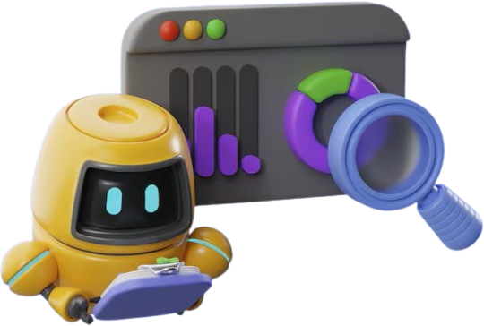
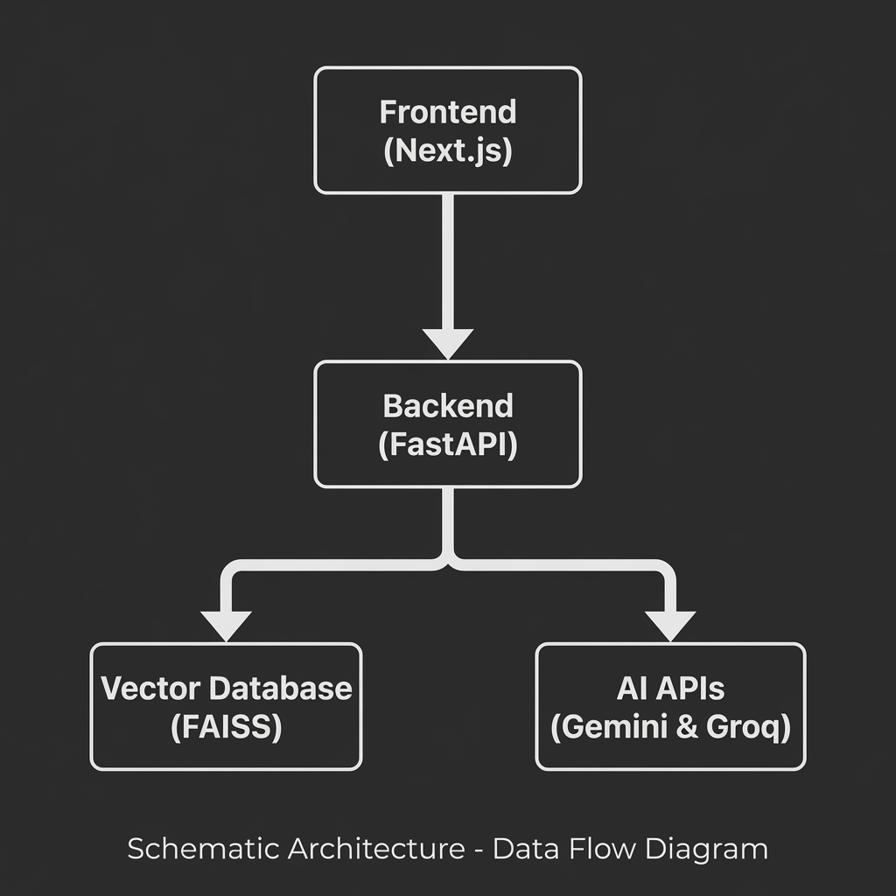

# Lumina RAG-App 🤖✨

<p align="center">
  
</p>

Lumina is a professional RAG (Retrieval-Augmented Generation) application built for intelligent document analysis and high-performance chatting.

## 🛠️ Tech Stack

Lumina is built using modern, high-performance technologies across the entire stack:

- **Frontend**: [Next.js](https://nextjs.org/) (React), [Tailwind CSS](https://tailwindcss.com/), [Framer Motion](https://www.framer.com/motion/), [Three.js](https://threejs.org/) (for 3D mascot).
- **Backend (API)**: [FastAPI](https://fastapi.tiangolo.com/) (Python) - Serves as serverless functions on Vercel.
- **AI Orchestration**: [LangChain](https://www.langchain.com/).
- **Vector Database**: [FAISS](https://github.com/facebookresearch/faiss) (Facebook AI Similarity Search).
- **LLMs**: [Llama-3](https://meta.ai/) (via [Groq](https://groq.com/)) and [Gemini](https://deepmind.google/technologies/gemini/) (for embeddings/analysis).
- **PDF Processing**: [PyMuPDF](https://pymupdf.readthedocs.io/).

## 🏗️ System Architecture & Workflow

The application follows a structured RAG pipeline to provide accurate, context-aware answers:

<p align="center">
  
</p>

1.  **Document Intake**: PDFs are uploaded via the frontend and processed by the FastAPI backend (located in `/api`).
2.  **Vectorization**: Using `PyMuPDF` for extraction and `Gemini Embeddings`, the document is split into smaller chunks and converted into high-dimensional vectors.
3.  **Indexing**: Vectors are stored in a `FAISS` local vector database (in-memory or `/tmp` on Vercel) for ultra-fast semantic search.
4.  **Retrieval**: When a user asks a question, the system finds the most relevant document chunks based on semantic similarity.
5.  **Generation**: The retrieved context + the user's query are sent to **Groq (Llama-3)** for high-speed, professional response generation.
6.  **Interactive Loop**: Features real-time thread editing and regeneration for a seamless, ChatGPT-like experience.

## 🚀 Quick Start (Local Setup)

### 1. Install Dependencies
Run the following command to install both frontend and backend dependencies:

```bash
# Install frontend packages
npm install

# Install backend packages
pip install -r api/requirements.txt
```

### 2. Configure Environment Variables
Create a `.env.local` file in the root directory and add:
```env
NEXT_PUBLIC_GOOGLE_API_KEY=your_key_here
NEXT_PUBLIC_GROQ_API_KEY=your_key_here
GOOGLE_API_KEY=your_key_here
GROQ_API_KEY=your_key_here
```

### 3. Run the App
To run the app locally with Vercel CLI (recommended):
```bash
vercel dev
```
Or run the frontend and backend separately:
- **Frontend**: `npm run dev`
- **Backend**: `uvicorn api.index:app --reload`

## 🔑 How to Get API Keys

To run this application, you will need two API keys:

1.  **Google API Key**: Used for document vectorization and embedding.
    - Get it here: [Google AI Studio](https://aistudio.google.com/app/apikey)
2.  **Groq API Key**: Used for ultra-fast Llama-3 chat responses.
    - Get it here: [Groq Cloud Console](https://console.groq.com/keys)

## ✨ Key Features
- **Intelligent RAG**: Deep document understanding with vector search.
- **Dynamic Interface**: Glassmorphic UI with 3D mascot and custom avatars.
- **ChatGPT Logic**: True in-thread message editing and answer regeneration.
- **Pro UI/UX**: Compact, mobile-responsive layout designed for productivity.
- **Vercel Optimized**: Ready for one-click deployment with serverless Python support.
