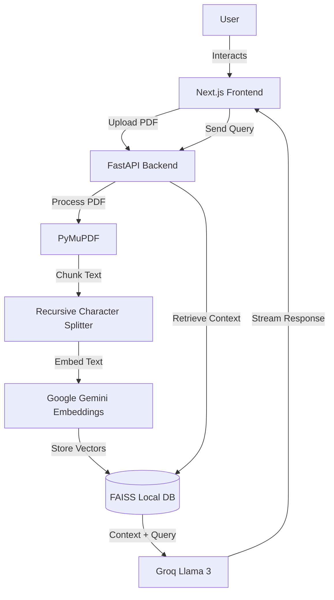

# 🤖 Lumina - RAG Chatbot Application

A modern, high-performance RAG (Retrieval-Augmented Generation) chatbot that allows users to chat with their PDF documents using generic AI models. Built with Next.js, FastAPI, LangChain, and Groq.


## 🌟 Features
*   **📄 PDF Analysis**: Upload and summarize PDF documents instantly.
*   **🧠 Contextual Chat**: Ask questions about your document and get accurate answers based strictly on its content.
*   **💾 Persistent Memory**: Your chat history and document index are saved locally, so you don't lose context after a refresh.
*   **🎨 Premium UI**: A beautiful, glassmorphism-inspired interface with smooth animations (Framer Motion).
*   **📂 Session Management**: Switch between multiple chat sessions or delete old ones easily.

## 🏗️ Architecture Visualization



---

## 🔑 1. Get Your API Keys
You need two API keys to run this application. Both are **Free** to start.

### **A. Google AI Studio (for Embeddings)**
1.  Go to [Google AI Studio](https://aistudio.google.com/app/apikey).
2.  Click **"Create API Key"**.
3.  Copy the key string (starts with `AIza...`).

### **B. Groq Cloud (for LLM Intelligence)**
1.  Go to [Groq Console](https://console.groq.com/keys).
2.  Login and click **"Create API Key"**.
3.  Name it "Lumina" and copy the key (starts with `gsk_...`).

---

## 🚀 2. Installation Guide

### **Step 1: Clone the Repository**
Open your terminal or command prompt and run:
```bash
git clone https://github.com/Jeeva1121/Rag-App.git
cd Rag-App
```

---

### **Step 2: Backend Setup**
This handles the heavy lifting (PDF processing & AI logic).

1.  **Navigate to the backend folder:**
    ```bash
    cd backend
    ```

2.  **Create a Virtual Environment (Optional but Recommended):**
    *   *Windows:* `python -m venv venv` then `.\venv\Scripts\activate`
    *   *Mac/Linux:* `python3 -m venv venv` then `source venv/bin/activate`

3.  **Install Python Libraries:**
    ```bash
    pip install -r requirements.txt
    ```

4.  **Configure Keys:**
    *   Create a new file named `.env` inside the `backend` folder.
    *   Open it in Notepad/VS Code and paste this:
        ```ini
        GOOGLE_API_KEY=paste_your_google_key_here
        GROQ_API_KEY=paste_your_groq_key_here
        ```

5.  **Start the Server:**
    ```bash
    python main.py
    ```
    ✅ You should see: `Uvicorn running on http://0.0.0.0:8000`

---

### **Step 3: Frontend Setup**
This handles the user interface (the web page).

1.  **Open a NEW terminal window** (keep the backend running in the first one).

2.  **Navigate to the frontend folder:**
    ```bash
    cd frontend
    ```

3.  **Install Node Libraries:**
    ```bash
    npm install
    ```

4.  **Configure Keys:**
    *   Create a new file named `.env.local` inside the `frontend` folder.
    *   Paste this:
        ```ini
        NEXT_PUBLIC_GOOGLE_API_KEY=paste_your_google_key_here
        NEXT_PUBLIC_GROQ_API_KEY=paste_your_groq_key_here
        ```

5.  **Start the Web App:**
    ```bash
    npm run dev
    ```
    ✅ You should see: `Ready in [...] http://localhost:3000`

---

## 🎮 3. How to Run (Daily Usage)

Whenever you want to use the app, just open two terminal windows:

**Terminal 1 (Backend):**
```bash
cd backend
python main.py
```

**Terminal 2 (Frontend):**
```bash
cd frontend
npm run dev
```

Then open your browser and go to **[http://localhost:3000](http://localhost:3000)**. Enjoy! 🎉

---

## 🛠️ Troubleshooting

*   **"Module not found: langchain"**: Run `pip install -r requirements.txt` again in the backend folder.
*   **"Upload Failed"**: Check if your Backend terminal is running and shows no errors.
*   **"API Key Invalid"**: Double-check your `.env` files and ensure there are no extra spaces around the keys.
